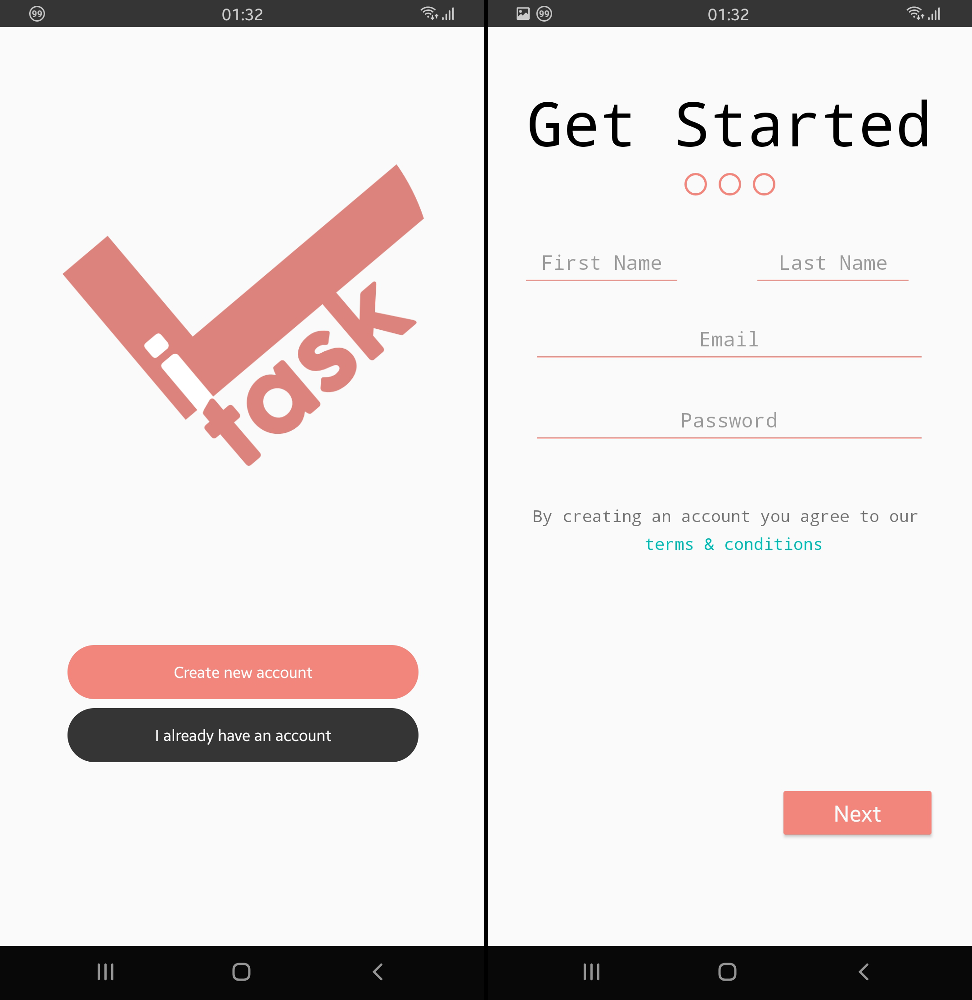
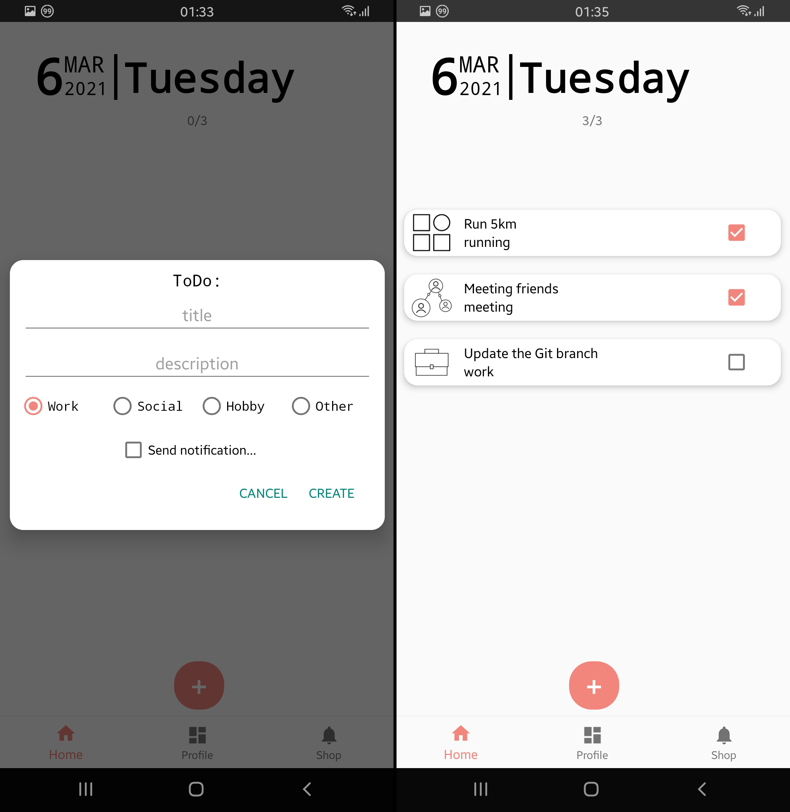
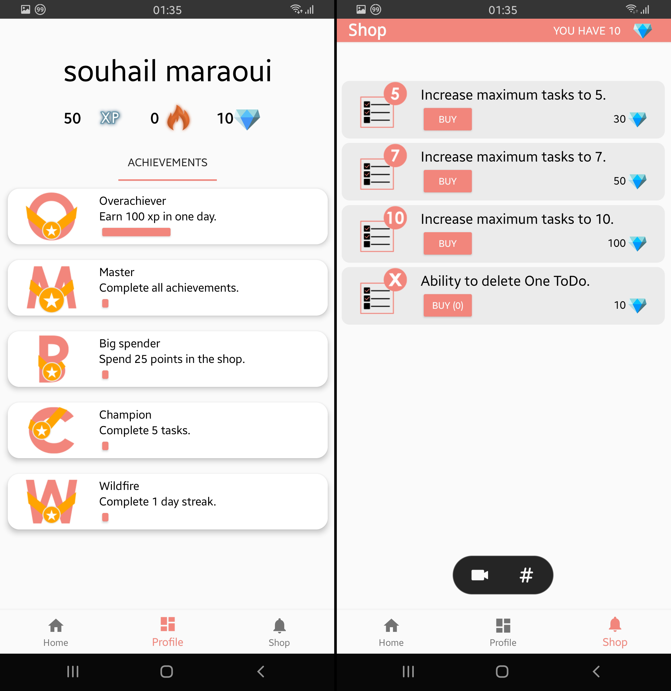

# iTask
In this Android application, we tried to implement the concept of gamifications to a simple todo app. Meaning that there is a system that rewards the user for completing all his tasks 5 days in a row for example, and a shop where he can spends those rewards.

# Screenshots

 
 
 

